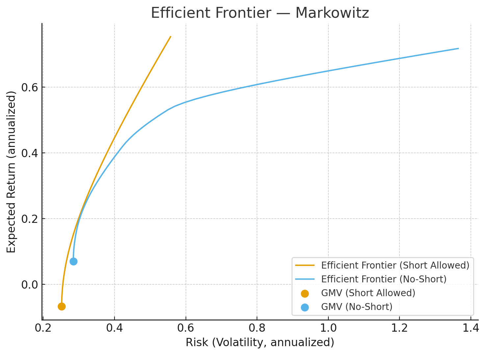

# Portfolio Optimization

## Classic Methods
#### 1. Mean-Variance / Markowitz
&ensp;&ensp;&ensp;&ensp;**Goal**: Maximize expected return for a given level of risk, or minimize risk for a given expected return. 
&ensp;&ensp;&ensp;&ensp;**Strengths**: Foundational framework of Modern Portfolio Theory (MPT). 
&ensp;&ensp;&ensp;&ensp;**Limitations**: Highly sensitive to estimation errors (mean return, covariance), can produce concentrated allocations.

#### 2. Minimum Variance Portfolio
&ensp;&ensp;&ensp;&ensp;**Goal**:Minimize total portfolio variance regardless of expected return. 
&ensp;&ensp;&ensp;&ensp;**Strengths**:Robust when returns are hard to forecast; simple; often diversified. 
&ensp;&ensp;&ensp;&ensp;**Limitations**:Ignores expected returns; can overweight low-vol assets; may underperform in bull markets.

#### 3. Risk Parity
&ensp;&ensp;&ensp;&ensp;**Goal**: Equalize risk contributions across assets/factors. 
&ensp;&ensp;&ensp;&ensp;**Strengths**: Less dependent on return forecasts; balanced risk; good out-of-sample stability. 
&ensp;&ensp;&ensp;&ensp;**Limitations**: Implicit leverage to low-vol assets; rate sensitivity; objective isn’t return-maximizing.

#### 4. Black–Litterman Model
&ensp;&ensp;&ensp;&ensp;**Goal**: Blend market equilibrium returns with investor views to get stable weights. 
&ensp;&ensp;&ensp;&ensp;**Strengths**: More stable, diversified allocations; mitigates estimation error; incorporates views coherently. 
&ensp;&ensp;&ensp;&ensp;**Limitations**: Requires priors and view specification; parameter tuning; added model complexity.

#### 5. Chance-Constrained Optimization
&ensp;&ensp;&ensp;&ensp;**Goal**: Bound probability of breaching a loss/risk threshold. 
&ensp;&ensp;&ensp;&ensp;**Strengths**: Direct control over tail-risk probabilities; aligns with risk limits. 
&ensp;&ensp;&ensp;&ensp;**Limitations**: Distributional assumptions needed; computationally heavier; sensitive to model misspecification.

#### 6. Resampled Efficient Frontier
&ensp;&ensp;&ensp;&ensp;**Goal**: Reduce sampling error by averaging solutions over bootstrapped inputs. 
&ensp;&ensp;&ensp;&ensp;**Strengths**: Smoother, more stable weights; better out-of-sample robustness. 
&ensp;&ensp;&ensp;&ensp;**Limitations**: Heuristic; results depend on resampling design; may dilute optimality.

#### 7. Hierarchical Risk Parity, HRP
&ensp;&ensp;&ensp;&ensp; **Goal**: Allocate via correlation clustering to diversify across clusters. 
&ensp;&ensp;&ensp;&ensp; **Strengths**: Handles noisy covariance; stable and diversified; avoids matrix inversion pitfalls. 
&ensp;&ensp;&ensp;&ensp; **Limitations**: Depends on clustering choices; less control over explicit return targets.

-------

## Modern/Algorithmic Methods
#### 1. Reinforcement Learning
&ensp;&ensp;&ensp;&ensp;**Goal**: Learn dynamic weights to maximize long-run reward (e.g., Sharpe). 
&ensp;&ensp;&ensp;&ensp;**Strengths**: Adapts to regime changes; multi-objective friendly; model-free potential. 
&ensp;&ensp;&ensp;&ensp;**Limitations**: Data-hungry; overfitting risk; hard to validate/explain; operational complexity.

#### 2. End-to-end Deep Learning
&ensp;&ensp;&ensp;&ensp;**Goal**: Map market data directly to weights without explicit forecasts. 
&ensp;&ensp;&ensp;&ensp;**Strengths**: Captures nonlinearity; flexible features; can integrate many signals. 
&ensp;&ensp;&ensp;&ensp;**Limitations**: Opaque “black box”; requires large, clean data; stability and generalization challenges.

#### 3. Quantum-Inspired / Quantum Optimization
&ensp;&ensp;&ensp;&ensp;**Goal**: Solve discrete/large QUBO-style portfolio problems efficiently. 
&ensp;&ensp;&ensp;&ensp;**Strengths**: Promising for combinatorial constraints; frontier research momentum. 
&ensp;&ensp;&ensp;&ensp;**Limitations**: Early-stage; hardware/solver limits; translation to business constraints nontrivial.

-----
## More:

### 1. Mean-Variance / Markowitz
**Efficient Frontier** 
$$Return= E[R_p​]=w_1​μ_1​+w_2​μ_2​+⋯+w_n​μ_n​=w^⊤μ$$ 
$$Risk= σ_p^2​=w^⊤Σcov$$

**GMV / MVP** 
$$min_w \sum_i w_i $$ s.t.$$ w^⊤Σcov=1$$

**Tangency Portfolio / Maximum Sharpe** 
$$Sharpe Ratio=\frac{E[R_p​]−r_f}{σ_p}$$

